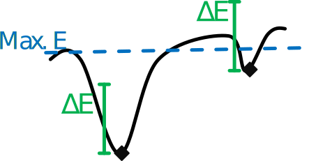

[](https://github.com/ViennaRNA/pourRNA/releases)
[](https://travis-ci.org/ViennaRNA/pourRNA)
[](https://github.com/ViennaRNA/pourRNA/releases)
[](https://anaconda.org/bioconda/pourRNA)

# pourRNA

A tool that computes local minima and respective transition rates of an RNA energy landscape.

## Installation

### Via Conda
If you are used to conda, the easiest way to install pourRNA is:
```
conda install -c bioconda pourrna
```

### From Linux Package
If you have an Arch, openSUSE, Debian or Ubuntu linux, you can download the pre-compiled package from:
```
https://www.tbi.univie.ac.at/~entzian/pourRNA_build/
```

### From Source

To configure, compile and install execute the following commands on your command line:
```
autoreconf -i
./configure [--help for additional configuration options]
make
make install
```
Dependencies:
  - [ViennaRNA library (>= 2.4.11)](https://www.tbi.univie.ac.at/RNA/#download)
  - [gengetopt](https://www.gnu.org/software/gengetopt/gengetopt.html)

If you installed the ViennaRNA library in a non-standard directory, you have to give the path to the main directory of the ViennaRNA library:
```
./configure --with-RNA=/path/to/ViennaRNA
```

If you download the [release](https://github.com/ViennaRNA/pourRNA/releases), you can skip `autoreconf -i` and you don't need gengetopt.


## First Steps

### Execute
The minimal input is an RNA sequence. Either per standard input (from a *.fasta file)
```
cat rna.fasta | pourRNA
```
or per command line argument
```
pourRNA --sequence="CUAGUUAGGAACGGAAUUAAUUAGGAAAAAGCUGAUUAG"
```

The content of the file rna.fasta should look similar to this:
```
> fasta header
CUAGUUAGGAACGGAAUUAAUUAGGAAAAAGCUGAUUAG
```


The output consists of the representative structures of the local minima and the transition rates between adjacent local minima.
You can adjust the output and speed up the computation by using additional command line parameters. All parameters are shown by
```
pourRNA --help
```

### Post-processing
If you are only interested in the thermodynamic equilibrium of the Markov process, you can simply extract the line with the equilibrium densities for the local minima:
```
cat rna.fasta | pourRNA | grep "Equilibrium Densities:" -A1
```

If you are interested in the dynamic folding behaviour, you need additional tools in order to post-process the output of pourRNA.
Usually the tool [treekin](https://www.tbi.univie.ac.at/RNA/Treekin/) is used, which needs two input files that should have the output format of the tool 'barriers'.
pourRNA can also be used to produce a barriers-like output.
```
cat rna.fasta | pourRNA --barriers-like-output=rna_barriers
```
As a second step you need one or several start structures for the initial population of the Markov process. In this example we extract the open chain structure from the barriers like output:
```
cat rna_barriers_states.out | grep -P "\s*\d+\s[\.]+\s+\-?\d*\.?\d*"
```
In this example the index of our start structure is 34.
With this we can start treekin:
```
cat ./rna_barriers_rates.out | treekin -m I --bar=./rna_barriers_states.out --p0 34=1.0 > treekin.out
```
The treekin output is a matrix with the time steps in the first column and the population densities for all local minima in the other columns.
This file can be visualized for example with the tool 'gracebat'.
```
gracebat -log x -nxy treekin.out -hdevice PostScript -hardcopy -printfile kinetics.ps
ps2pdf kinetics.ps
```
The final kinetics.pdf shows the folding process from the initial population until the thermodynamic equilibrium is reached.


If you don't have access to treekin and want to use the R script within the scripts directory of this project, you can compute the kinetics pdf file as follows:
```
cat rna.fasta | pourRNA --barriers-like-output=rna_barriers --binary-rates-file=rna_rate_matrix
Rscript ./scripts/read_matrix_plot_kinetics.R --binary_matrix ./rna_rate_matrix --states_file ./rna_barriers_states.out --initial_state=34
```
The output of this call is the file `rna_rate_matrix.pdf` within the current directory.


## Parameters

### max-threads
Use this parameter in order to speed up the rate computation by distributing the flooding of several basins among several threads.
```
cat rna.fasta | pourRNA --max-threads=8
```

### Micro state filter:
A global energy threshold can be set with `--max-energy=` a value in kcal/mol. This energy is an **absolute** threshold.
If you want to include, for example, the open chain structure (without any base pairs), then you should set this threshold above zero. The default value is 5 kcal/mol.

This filter can also be applied on a local level, which is called `--delta-e=` a value in kcal/mol. This energy is the maximum energy threshold **relative** to the energy of each basin that is currently flooded. So it makes a difference if you start the exploration with the open chain structure or with the MFE structure.




### Macro state filter: maxNeighE and kBest
Using these filters you can compute approximate RNA folding kinetics, which is much faster. 
However, these filters can lead to very different results if they are too restrictive.
The --max-neigh-e filter reduces outgoing transitions to the neighbored minima, for which the energy is lower than
the energy of the current minimum plus the filter value (E(neighbored minimum) < E(current minimum) + filterValue).
This helps to avoid the exploration of minima that are too high in the energy landscape to contribute much to the final folding kinetics.


The --filter-best-k filter follows takes an integer k as input. From a given initial structure it explores only the k neighbored basins, with the highest transition rates. 

Both filters can be applied at the same time, however, the order of these filters is important (in order to get reproducible results) because the highest rates are not not necessarily leading to energetically lower neighbored gradient basins. 
Thus, we first have to prune all "up-hill" transitions before reducing the remaining to the k best

The kBest filter can be dynamically adjusted with `--dynamic-best-k`, which increases the number of transitions iteratively until the MFE structure is discovered.

## Use cases

- compute the partition functions for all local minima and their probability in the thermodynamic ensemble
- compute the rate matrix and the folding kinetics from an ensemble of structures to the thermodynamic equilibrium
- compute refolding paths on macro-state level

## Output

This is the example output:
```
echo "ACGUUGCAACGU" | pourRNA 

Sequence:                      ACGUUGCAACGU
MFE structure:                 ((((....))))
The start state is:            ............
The start state ends in basin: ............
The final state is:            
The final minimum is: 
Number of minima: 3

              --------------THE FINAL RATE MATRIX----------------------- 

 from : to

     0 [((((....))))] : 1 = 5.601344e-03 
     1 [............] : 0 = 3.844359e-02, 2 = 1.743583e-03 
     2 [....((...)).] : 1 = 1.000000e+00 

Equilibrium Densities:
(8.726331e-01, 1.271452e-01, 2.216883e-04)

The overall partition function is: 8.055290e+00
number of rates: 4

finished computation at Wed Apr  3 11:12:33 2019
elapsed time: 7.505980e-04s

```

At first it prints the most important initial conditions. The sequence, the most stable structure, the initial state for the exploration and the final state that stops the exploration (if it was set).
Then it prints the rate matrix in a sparse text format (state index, representative local minimum structure and then all outgoing transition rates).
Finally it prints the equilibrium densities for all local minima (in the same order as the rate matrix indices).

The tool can also output transition rates in different matrix formats.

- `--binary-rates-file=` writes a binary file with all matrix entries 
(number of states, rates from 0 to n, rates from 1 to n, etc. as double values)

- `--binary-rates-file-sparse=` the sparse format is: First value is the number of states (uint_32), then <uint_32 from>, <uint_32 number of how many value pairs to>, <value pair <uint_32 to, double rate from, to>> etc.

- `--barriers-like-output=` produces the same output format as the tool barriers. The result is a file with the rate matrix in text format and a file with the structures in dot-parentheses format. Both files have the same prefix.


If you are interested in refolding paths, you can output a file with all saddle heights (`--saddle-file=`) and apply a Dijkstra algorithm in order to find a path with the minimal saddle height between two structures in the landscape. A python script that reads the saddle file and computes the path can be found in the scripts directory of this project.

For additional output options or parameters you can look up the description in the manual or in the help text of the tool. Simply type:
```
man pourRNA
```
or
```
pourRNA --help
```


In case you run into problems, please contact us!


&copy; Gregor Entzian, 2019

